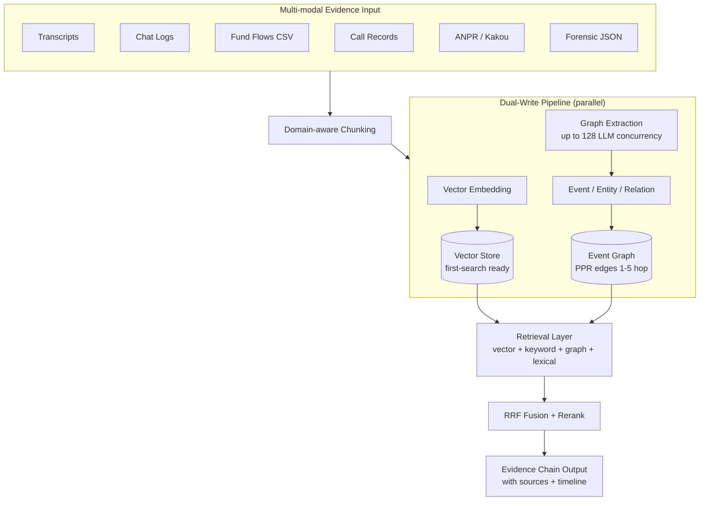
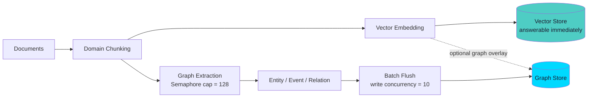
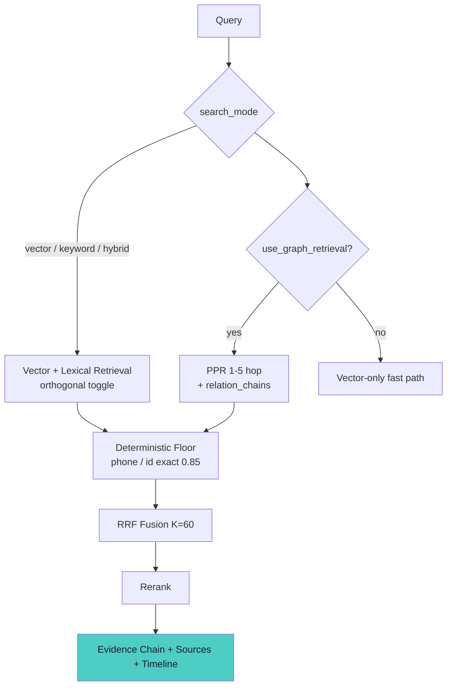
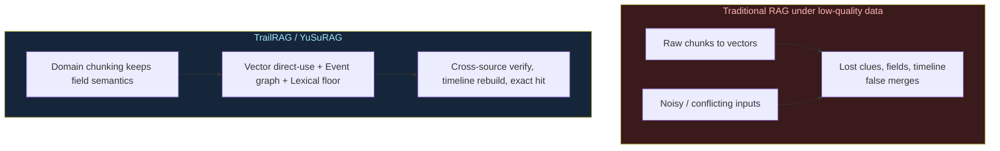
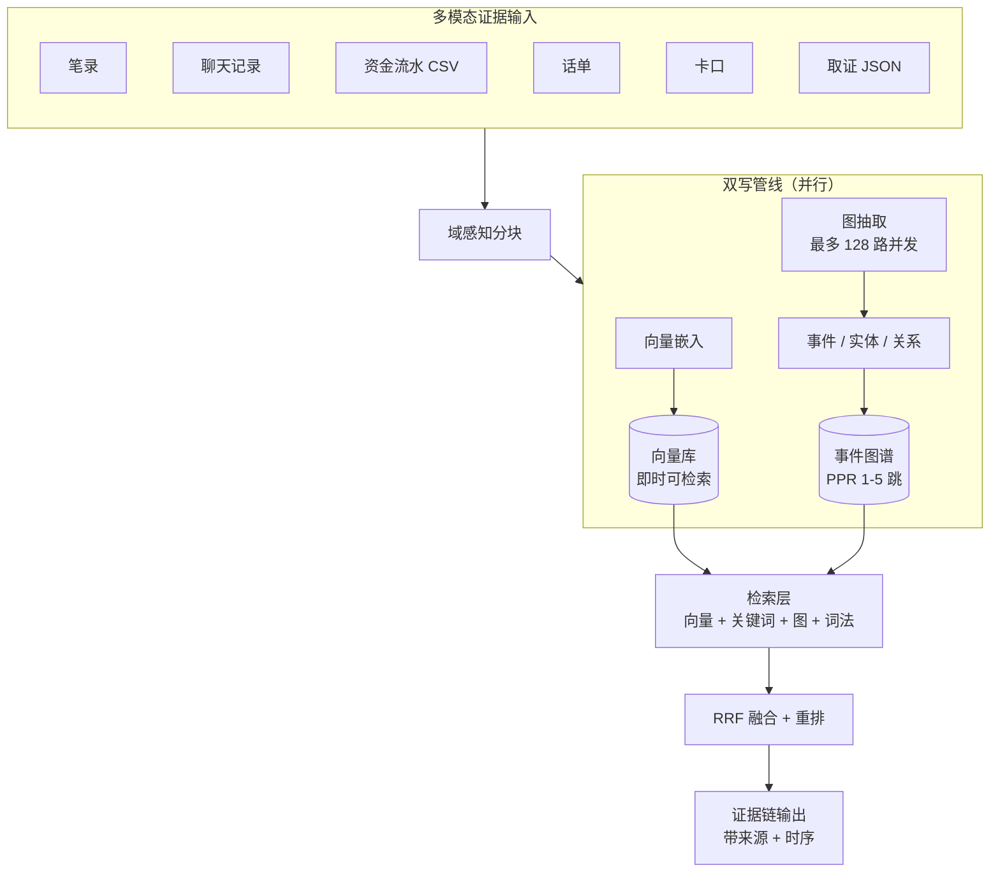
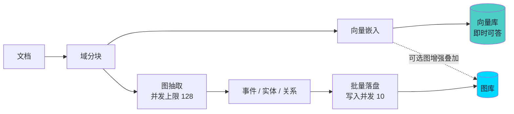
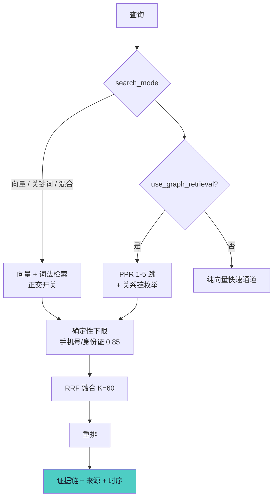
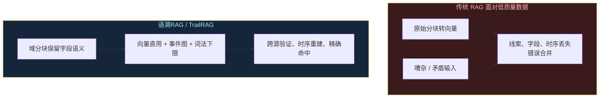

<div align="center">

# TrailRAG

**Trace every clue — RAG with evidentiary, multi-hop, time-aware retrieval.**

*语溯RAG · 循迹每一处线索：带证据链、多跳、时序感知的检索增强生成框架*

[](https://www.python.org)
[-ff6b6b?style=for-the-badge&logoColor=white&labelColor=1a1a2e)](./LICENSE)
[](./readme.md)
[](./RAG三套知识库权威对比分析报告_语溯vsLightRAGvsGraphRAG.md)

</div>

<div align="center">
  <div style="width:100%;max-width:760px;margin:18px auto;padding:14px 18px;background:#fff7ed;border:1px solid #fdba74;border-radius:12px;color:#9a3412;font-size:13.5px;line-height:1.6;text-align:left;">
    <b>⚠️ Development status / 开发状态</b><br>
    <b>EN:</b> The open-source version is <b>under active development</b>; source code will be published to this repository soon. This README documents the design, architecture, and benchmark results ahead of the code release. Install/run commands shown below are <b>planned interfaces</b>, not yet available.<br>
    <b>中文：</b>开源版本<b>正在开发中</b>，源代码将于近期上传至本仓库。本 README 在代码发布前先行说明设计、架构与基准结论。下述安装/运行命令为<b>规划中的接口</b>，暂未提供。
  </div>
</div>

---

## English Version — TrailRAG

### Why TrailRAG

Traditional RAG works well on clean, high-quality corpora, but it **breaks on the messy reality of investigative evidence**: chat logs are noisy, witness statements contradict each other, fund-flow and call logs are incomplete, and structured tables (CSV/XLSX) get flattened into loose text. Clues are diluted by semantic noise, field semantics are lost, there are no event nodes to hop across, and no time model to rebuild "who did what, when".

**TrailRAG** is built for exactly this. It keeps a traditional vector-direct RAG channel for instant answers, and adds a **graph-augmented channel rooted in event nodes** that links chats → statements → fund flows → call logs → forensic records into a **closed, multi-hop, time-aware evidence chain** — surfacing contradictions instead of silently merging them.

### Architecture



*Figure 1 — System architecture: a vector-direct channel and a graph-augmented channel run in parallel over mixed evidentiary data, backed by Vector / Graph / KV storage, and produce explainable, citable answers. High-res SVG: [trailrag-architecture.svg](assets/trailrag-architecture.svg)*

### Features

1. **Dual-engine indexing** — chunks become searchable the moment they are embedded (vector-direct), while graph augmentation builds the evidence graph in parallel; no need to wait for the full graph before the first query.
2. **Event-node graph** — graph nodes are *events* (not just keywords/entities), making cross-source, time-ordered reasoning natural.
3. **Multi-hop retrieval** — Personalized PageRank over the event graph (1–5 hops, default 3) plus explicit relation-chain enumeration for closed evidence.
4. **Lexical deterministic channel** — exact identifier matching (phone / ID / case number) with a `0.85` similarity floor, so deterministic clues survive semantic noise.
5. **Usable under low-quality data** — preserves CSV field semantics, anchors on events, and surfaces conflicting statements rather than hallucinating a single answer.
6. **Timeline reconstruction** — recovers "who did what, when" across the whole case from time-bearing events.
7. **Mixed data types** — chats, statements, fund-flow CSV, call logs, ANPR/Kakou, forensic JSON, and Office documents.
8. **Explainable output** — every answer carries source citations and a reconstructable evidence path.
9. **High indexing speed** — up to 128 concurrent LLM extraction calls with bounded graph-write concurrency and cross-chunk batch flush.
10. **Pluggable storage** — Vector DB, Graph DB, and KV Store are swappable (e.g. Milvus / Neo4j / PostgreSQL).

### Workflow

**Indexing (dual-engine, in parallel)**



*Figure 2 — Indexing flow. The vector-direct channel answers fast; the graph-augmented channel extracts event nodes with up to 128 concurrent LLM calls and bounded graph-write concurrency (10), flushing in cross-chunk batches. High-res SVG: [trailrag-indexing.svg](assets/trailrag-indexing.svg)*

**Query**



*Figure 3 — Query flow. Vector/keyword retrieval runs first as an orthogonal toggle; optional graph PPR (1–5 hops), relation-chain enumeration, and the lexical deterministic floor (0.85) are fused via RRF (K=60) and reranked into a closed evidence chain. High-res SVG: [trailrag-query.svg](assets/trailrag-query.svg)*

### Principle: usable under low-quality data



*Figure 4 — Under noisy, contradictory evidence, traditional RAG loses clues, fields, and time; TrailRAG traces through via event nodes, a lexical deterministic floor, preserved field semantics, and closed multi-hop chains. High-res SVG: [trailrag-principle.svg](assets/trailrag-principle.svg)*

### Quick Start (planned)

> Source code is not yet published. The interface below reflects the **planned** design.

```bash
# Planned: install
# pip install trailrag        # or: uv pip install trailrag

# Planned: build an index from mixed evidence
from trailrag import TrailRAG

rag = TrailRAG(
    working_dir="./case_index",
    llm="openai-compatible-endpoint",
    embedding="openai-compatible-embedding",
)
await rag.insert_files(["./evidence/"])   # chats, statements, csv, json, xlsx ...

# Planned: query with graph augmentation on
answer = await rag.query(
    "who lured the victim into the transfer on 2026-03-12, and which bank card?",
    use_graph_retrieval=True,        # optional graph multi-hop
    search_mode="hybrid",           # vector / keyword / hybrid
)
print(answer.text, answer.citations)  # explainable evidence chain
```

### Key Configuration

| Parameter | Meaning | Default |
|---|---|---|
| `search_mode` | vector / keyword / hybrid (orthogonal to graph) | `hybrid` |
| `use_graph_retrieval` | enable graph multi-hop channel | `True` |
| LLM extraction concurrency | max parallel LLM calls for graph build | `128` |
| `GRAPH_WRITE_CONCURRENCY_LIMIT` | bounded graph-write concurrency | `10` |
| PPR hops | multi-hop depth on event graph | `1–5` (default `3`) |
| lexical `exact_score_floor` | deterministic identifier match floor | `0.85` |
| RRF `K` | reciprocal-rank fusion constant | `60` |
| `MAX_ENTITY/RELATION/TOTAL_TOKENS` | recall context token budget | tunable |

*Parameters reflect the current design/implementation; final names may change before release.*

### Benchmarks

TrailRAG has been compared, line-by-line at the source-code level, against LightRAG and Microsoft GraphRAG across retrieval accuracy, indexing speed, multi-hop reasoning, token efficiency, robustness, and an evidentiary mining track on low-quality data.

📊 **Full report:** [RAG三套知识库权威对比分析报告（语溯RAG vs LightRAG vs GraphRAG）](./RAG三套知识库权威对比分析报告_语溯vsLightRAGvsGraphRAG.md)

Headline (purpose-weighted, evidentiary/low-quality scenario): **TrailRAG 94.4% · LightRAG 80.2% · GraphRAG 67.4%**. TrailRAG leads in retrieval accuracy, indexing speed, multi-hop reasoning, and the evidentiary-mining track; it is intentionally scored lower than general-purpose frameworks on code robustness / token efficiency / error tolerance, where those frameworks' broader engineering maturity shows.

### Roadmap

- [ ] Publish core source (vector-direct + graph-augmented engine)
- [ ] WebUI for insert / query / visualize the evidence graph
- [ ] Pluggable storage adapters (Milvus / Neo4j / PostgreSQL)
- [ ] English + Chinese documentation site
- [ ] Public benchmark scripts on `fraud_case_v1`-style datasets
- [ ] License finalization

### Documentation

- 📊 Benchmark & comparison report (this repo): [RAG三套知识库权威对比分析报告](./RAG三套知识库权威对比分析报告_语溯vsLightRAGvsGraphRAG.md)
- Architecture and workflow diagrams (Mermaid sources): see the code blocks above; high-res SVG versions: [assets/](./assets/)

### Contributing

Contributions are welcome once the source is published. Please read `CONTRIBUTING.md` before opening a pull request.

### Citation

```bibtex
@misc{trailrag2026,
  title        = {TrailRAG: Trace every clue — evidentiary, multi-hop, time-aware retrieval},
  author       = {TrailRAG Authors},
  year         = {2026},
  howpublished = {\url{https://github.com/your-org/TrailRAG}},
  note         = {Under active development; source to be released}
}
```

> Replace `your-org/TrailRAG` with the final repository path after publication.

### Acknowledgements

TrailRAG stands on the shoulders of the open-source RAG community (LightRAG, GraphRAG, and others). The benchmark report compares designs at the source level for transparency; all systems are credited for their respective strengths.

---

## 中文版 — 语溯RAG

### 为什么要用语溯RAG

传统 RAG 在干净、高质量语料上表现良好，但在**取证证据的真实乱象**前会断裂：聊天记录嘈杂、笔录彼此矛盾、资金流水与话单不全、结构化表格（CSV/XLSX）被压平为松散文本。线索被语义噪声稀释、字段语义丢失、没有可跨源跳跃的"事件"节点、也没有时间模型去还原"某人某时干了某事"。

**语溯RAG** 正是为这种场景而生。它保留一套传统向量直用通道以即时作答，并叠加一条**以"事件节点"为根的图增强通道**，把聊天 → 笔录 → 资金流水 → 话单 → 取证记录连成一条**闭合、多跳、带时序的证据链**——显式呈现矛盾，而非静默合并。

### 系统架构



*图 1 — 系统架构：向量直用通道与图增强通道在混合证据数据上并行运行，底层为向量/图/KV 三类存储，输出可解释、可溯源的答案。高清矢量版：[trailrag-architecture.svg](assets/trailrag-architecture.svg)*

### 核心特性

1. **双机制索引** —— 分块一完成向量化即可检索（向量直用），图增强同时并行构建证据图；不必等全图建完才能首次查询。
2. **事件节点图谱** —— 图节点是"事件"而非仅关键词/实体，使跨源、按时间顺序的推理更自然。
3. **多跳检索** —— 在事件图上做个性化 PageRank（1–5 跳，默认 3），并显式枚举关系链以闭合证据。
4. **词法确定性通道** —— 对手机号/身份证/案件编号等做精确匹配，设 `0.85` 相似度下限，让确定性线索不被语义噪声吞没。
5. **低质量数据可用** —— 保留 CSV 字段语义、以事件锚定、显式呈现矛盾陈述，而非臆造单一答案。
6. **时序重建** —— 从带时间的事件中还原全案"某人某时干了某事"。
7. **混合数据类型** —— 聊天、笔录、资金流水 CSV、话单、卡口、取证 JSON、Office 文档通吃。
8. **可解释输出** —— 每个答案都带来源引用与可复现的证据路径。
9. **高索引速度** —— 图构建最多 128 路并发 LLM 抽取，图写入并发受控（10），跨分块批量落盘。
10. **可插拔存储** —— 向量库、图库、KV 库可替换（如 Milvus / Neo4j / PostgreSQL）。

### 工作流程

**入库（双机制并行）**



*图 2 — 入库流程。向量直用通道先就绪可答；图增强通道以最多 128 路并发 LLM 抽取事件节点、图写入并发受控（10）、跨分块批量落盘。高清矢量版：[trailrag-indexing.svg](assets/trailrag-indexing.svg)*

**检索**



*图 3 — 检索流程。向量/关键词检索作为正交开关先跑；可选的图 PPR（1–5 跳）、关系链枚举与词法确定性下限（0.85）经 RRF（K=60）融合并重排，形成闭合证据链。高清矢量版：[trailrag-query.svg](assets/trailrag-query.svg)*

### 原理：低质量数据下依然可用



*图 4 — 在嘈杂、矛盾的证据下，传统 RAG 丢失线索、字段与时间；语溯RAG 借事件节点、词法确定性下限、保留字段语义与闭合多跳链循迹还原。高清矢量版：[trailrag-principle.svg](assets/trailrag-principle.svg)*

### 快速开始（规划中）

> 源代码尚未发布。以下接口为**规划中**的设计形态。

```bash
# 规划中：安装
# pip install yusurag        # 或: uv pip install yusurag

# 规划中：从混合证据建索引
from yusurag import YuSuRAG

rag = YuSuRAG(
    working_dir="./case_index",
    llm="openai-compatible-endpoint",
    embedding="openai-compatible-embedding",
)
await rag.insert_files(["./evidence/"])   # 聊天、笔录、csv、json、xlsx ...

# 规划中：开启图增强检索
answer = await rag.query(
    "谁在 2026-03-12 诱骗受害人转账，并关联到哪张银行卡？",
    use_graph_retrieval=True,
    search_mode="hybrid",
)
print(answer.text, answer.citations)  # 可解释证据链
```

### 关键配置

| 参数 | 含义 | 默认 |
|---|---|---|
| `search_mode` | 向量/关键词/混合（与图正交） | `hybrid` |
| `use_graph_retrieval` | 开启图多跳通道 | `True` |
| LLM 抽取并发 | 图构建最大并行 LLM 调用 | `128` |
| `GRAPH_WRITE_CONCURRENCY_LIMIT` | 图写入受控并发 | `10` |
| PPR 跳数 | 事件图多跳深度 | `1–5`（默认 `3`） |
| 词法 `exact_score_floor` | 确定性标识符匹配下限 | `0.85` |
| RRF `K` | 倒数排名融合常数 | `60` |
| `MAX_ENTITY/RELATION/TOTAL_TOKENS` | 召回上下文 token 预算 | 可调 |

*参数反映当前设计与实现，正式发布前名称可能调整。*

### 基准与对比

语溯RAG 已与 LightRAG、Microsoft GraphRAG 在源码层逐行对比，覆盖检索准确度、入库索引速度、多跳推理、Token 效率、健壮性，以及面向低质量数据的"证据挖掘专项"。

📊 **完整报告：** [RAG三套知识库权威对比分析报告（语溯RAG vs LightRAG vs GraphRAG）](./RAG三套知识库权威对比分析报告_语溯vsLightRAGvsGraphRAG.md)

核心结论（目的加权·取证/低质量场景）：**语溯RAG 94.4% · LightRAG 80.2% · GraphRAG 67.4%**。语溯RAG 在检索准确度、入库速度、多跳推理与证据挖掘专项领先；在代码健壮性 / Token 效率 / 错误容忍度上，因通用框架工程更成熟，语溯RAG 诚实地评为略低。

### 路线图

- [ ] 发布核心源码（向量直用 + 图增强引擎）
- [ ] 证据图谱可视化 WebUI（插入 / 查询 / 可视化）
- [ ] 可插拔存储适配（Milvus / Neo4j / PostgreSQL）
- [ ] 中英双语文档站
- [ ] 基于 `fraud_case_v1` 类数据的公开基准脚本
- [ ] 许可证定稿

### 文档

- 📊 基准与对比报告（本仓库）：[RAG三套知识库权威对比分析报告](./RAG三套知识库权威对比分析报告_语溯vsLightRAGvsGraphRAG.md)
- 架构与流程原理图（Mermaid 源见上文代码块；高清矢量版：[assets/](./assets/)）

### 贡献

源码发布后欢迎各类贡献。提交 Pull Request 前请阅读 `CONTRIBUTING.md`。

### 引用

```bibtex
@misc{yusurag2026,
  title        = {语溯RAG：循迹每一处线索——带证据链、多跳、时序感知的检索增强生成},
  author       = {语溯RAG 作者团队},
  year         = {2026},
  howpublished = {\url{https://github.com/your-org/TrailRAG}},
  note         = {开源版本开发中，源码待发布}
}
```

> 发布后请将 `your-org/TrailRAG` 替换为最终仓库路径。

### 致谢

语溯RAG 站在开源 RAG 社区（LightRAG、GraphRAG 等）的肩膀上。对比报告在源码层透明比较各家设计，并如实认可各系统的优势。
